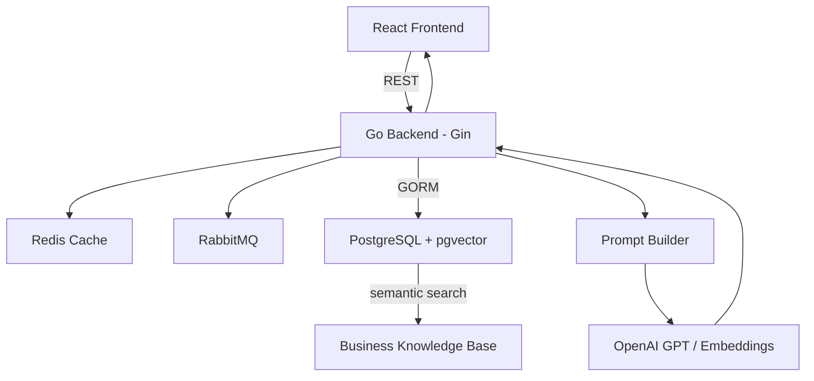

<div align="center">

# RedGo AI

**AI-Powered Business Consultation Platform**
Translating an experienced business consultant's decision-making framework into an AI-assisted consultation workflow.


</div>

---

## About RedGo AI

RedGo AI helps founders and MSMEs receive structured business guidance through an AI-powered consultation experience.

Rather than answering questions directly like a generic chatbot, RedGo first guides users through a **structured business diagnosis** to uncover the real constraint behind their problem — then generates recommendations grounded in an expert-designed decision framework using **Retrieval-Augmented Generation (RAG)**.

This repository serves as the **landing page** for the RedGo AI project. The actual source code is split across two separate repositories — see the links below.

---

## Repositories

| Repository | Description |
|---|---|
|  [`REDGO-BACKEND`](https://github.com/Arief1222/REDGO-BACKEND/) | Go REST API, AI orchestration, RAG pipeline, authentication, payments |
|  [`REDGO-FRONTEND`](https://github.com/Arief1222/REDGO-FRONTEND/) | React + TypeScript client — diagnosis flow, AI chat, admin tools |

---

## Product Flow

```
Landing → Diagnosis → Chat → Recommendation
```

The product deliberately front-loads **Diagnosis** before **Chat** — the AI doesn't respond until it first understands the user's business context.

---

## System Architecture



Full architecture details, technical decision rationale, and additional diagrams live in [`docs/architecture/`](docs/architecture/).

---

## Technology Overview

| Layer | Stack |
|---|---|
| Frontend | React 19, TypeScript, Vite, MUI, Tailwind CSS |
| Backend | Go 1.25, Gin, GORM |
| AI / RAG | OpenAI GPT, OpenAI Embeddings, pgvector |
| Database | PostgreSQL (self-hosted Supabase) + pgvector |
| Infrastructure | Docker, Fly.io, RabbitMQ, Redis |

Full dependency versions are listed in each repository's respective README.

---

## Repository Structure

```
RedGo-AI/
├── README.md
├── docs/
│   ├── architecture/       # System diagrams, RAG pipeline, decision log
│   └── images/              # Screenshots & visual assets
└── LICENSE
```

---

## Project Status

Prototype completed. Development is currently paused while the business strategy and product direction are being refined ahead of the next iteration.

---

## Current Limitations

- No formal hallucination evaluation on AI responses
- No confidence estimation mechanism
- Human oversight is still required for critical business decisions
- Recommendation quality depends on the completeness of the knowledge base

A more detailed roadmap (hallucination detection, human-in-the-loop verification, evaluation framework) is outlined in the backend repository's README.

---

## License

Private Project.
Source code is shared for portfolio purposes only.
